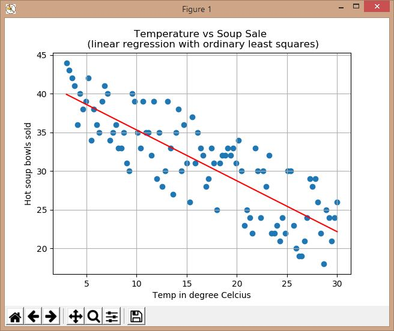

# Learning Machine Learning
<i>Pun fully intended. #NO_REGRETS  </i> 

I have previously created and used Artificial Neural Networks(ANN) with the help
of the MATLAB System Identification (essentially for regression) for
training an ANN on simulation data of UAV landing gear shock absorbtion and
suspension characteristics when rolling over different kind of runways and under
multiple simulated base excitations.

### So.
I want to break apart the Machine Learning(ML) algorithms and understand them. 
Moreover, we have so much amazing AI and ML toolboxes such as Tensorflow, Keras,
scikit-learn that many people are able to create amazing things. However at the
expense of not fully understanding the concepts involved in such libraries and
hence not able to essentialy create optimised solutions for the problems that
they are trying to solve. 

Enough said. Let's get coding.

## Author : Sayan Bhattacharjee
## Email  : aero.sayan@gmail.com

### Contents
ML is vast. And I do not want to pollute my github repo with learning material.
So all ML related learning and practice code will be in this repo.
And they are...
+ src/01_soup_sale.py : Linear regression using ordinary least square
	- Winter season temperature vs hot soup sale. Yum!
	- We fit a line through the data points using linear regresion.
	- RESULT   
	- More images in images/ folder.
